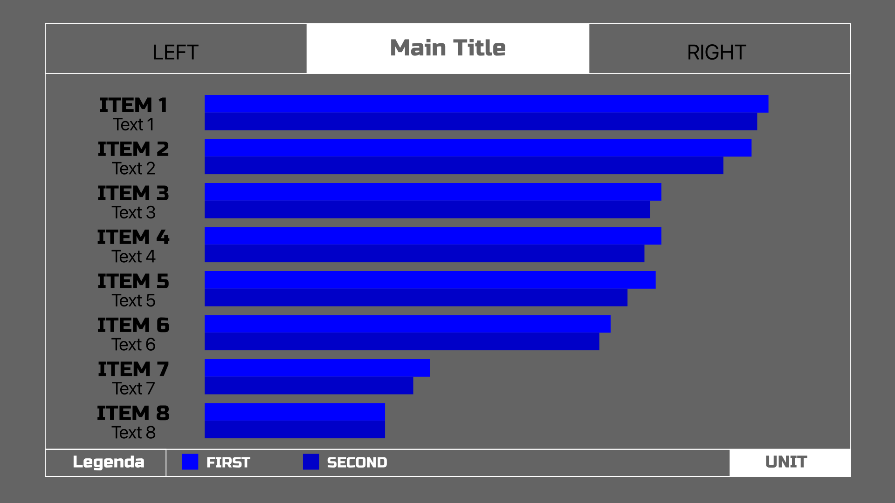

# Svg Charts Builder
**Build charts from 1-16 items**



# Usage : 
## Console Usage : 
- First create `template.json`
- Second run `node app.js` with arguments

## Argmunets : 
- Input with extension : `-i input.json`  **Required**
- Ouput without extension : `-o output`   **Required**
- Type png : `-t png`                     **Not required**

## Requirement : 
- Fonts :
  - Russo one
- Npm Packages :
  - Sharp install : `npm install sharp`
  - Argparser install : `npm install argparse`

## Exeample Input : 
```json
{
  "title": "Main Title",
  "labels": {
    "left": "LEFT",
    "right": "RIGHT"
  },
  "unit": {
    "unit": "UNIT",
    "first": "FIRST",
    "second": "SECOND"
  },
  "page": {
    "item": {
      "name": "ITEM 1",
      "text": "Text 1",
      "line1": 100,
      "line2": 98
    },
    "item2": {
      "name": "ITEM 2",
      "text": "Text 2",
      "line1": 97,
      "line2": 92
    },
    "item3": {
      "name": "ITEM 3",
      "text": "Text 3",
      "line1": 81,
      "line2": 79
    },
    "item4": {
      "name": "ITEM 4",
      "text": "Text 4",
      "line1": 81,
      "line2": 78
    },
    "item5": {
      "name": "ITEM 5",
      "text": "Text 5",
      "line1": 80,
      "line2": 75
    },
    "item6": {
      "name": "ITEM 6",
      "text": "Text 6",
      "line1": 72,
      "line2": 70
    },
    "item7": {
      "name": "ITEM 7",
      "text": "Text 7",
      "line1": 40,
      "line2": 37
    },
    "item8": {
      "name": "ITEM 8",
      "text": "Text 8",
      "line1": 32,
      "line2": 32
    }
  }
}
```
Save as file `.json`

## Exeample run : 
`node app.js -i template.json -o output -t png`
